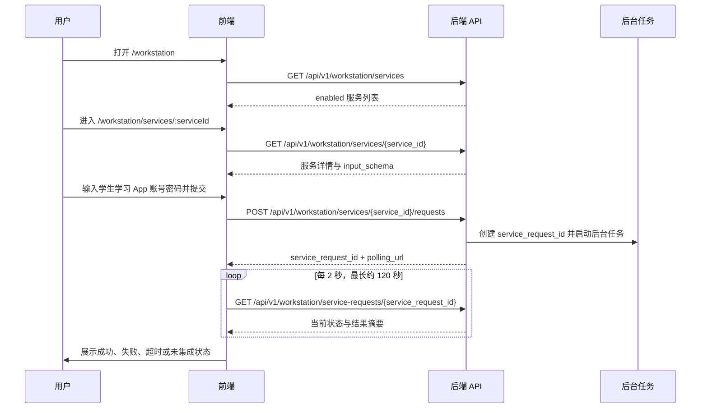

# Lumitime 前后端对接说明：完整前端对接版

版本：2026-06-16  
读者：前端、后端、测试与验收人员  
范围：登录注册、公开页、受邀内容页、个人中心、工作站、后台管理读写闭环、路由覆盖、异步服务请求轮询、敏感信息处理约定。

## 1. 当前对接结论

- 前端已补齐信息架构要求的工作站动态路由：`/workstation/services/:serviceId`、`/workstation/records/:requestId`。
- 前端已补齐后台独立入口路由：`/admin/users`、`/admin/audit-logs`、`/admin/service-requests`、`/admin/workstation/services` 等路径可以直接访问，并映射到现有后台页的对应区块。
- 日志自动提交页已从前端随机 ID 和 `setTimeout` 模拟，改为调用后端真实异步创建接口，再按 `service_request_id` 轮询详情接口。
- 联调默认关闭认证、服务列表、提交记录、公开页、内容页、后台管理页的 mock/演示兜底：接口失败即展示错误，接口返回空列表即展示真实空态，不再用本地假数据掩盖接口问题。
- 登录态刷新已改为先调用 `GET /api/v1/auth/me` 校验后端 session；Cookie 失效时会清除前端本地用户摘要并回到登录流程。
- 公开随记、大屏、脚本/作品/博客列表与详情、个人中心最近提交与修改密码已切到真实 API。
- 后台已完成邀请码、用户、内容、留言、工作站服务、服务记录、审计、统计快照与 CSV 导出的前端读写闭环。
- 为支撑后台完整对接，后端已补齐 `GET /api/v1/admin/contents`、`GET /api/v1/admin/contents/{content_id}`、`GET /api/v1/admin/messages`、`GET /api/v1/admin/workstation/services`、`GET /api/v1/admin/workstation/services/{service_id}`。
- 审计敏感字段已按文档偏向调整：服务请求审计 metadata 中使用 `student_account_hash`，不写入学生学习 App 完整账号；用户侧/记录侧可展示 `student_account_masked`。
- 前端采用 HashRouter。本文中的前端路径指 hash 内部路径，浏览器实际地址示例为 `http://localhost:5174/#/workstation/services/service_log_auto_submit`。

## 2. 本地环境约定

| 项目 | 约定 |
| --- | --- |
| 后端服务 | `http://127.0.0.1:8000` |
| API 前缀 | `/api/v1` |
| 前端开发服务 | 常用 `http://localhost:5174`，也兼容 Vite 默认 `5173` |
| 前端 API 访问 | 统一请求 `/api/v1/...`，由 Vite proxy 转发到 `http://127.0.0.1:8000` |
| 会话凭证 | 后端写入 HttpOnly Cookie：`lumitime_session`；前端请求必须带 `credentials: include` |
| 默认管理员 | `admin` / `admin` |
| 默认受邀用户 | `member` / `member123` |
| 默认邀请码 | `LUMI-A1B2` |
| 前端演示登录开关 | `VITE_ENABLE_DEMO_AUTH=false`，联调默认关闭 |

后端 CORS 默认只包含 `http://localhost:5173` 和 `http://127.0.0.1:5173`。当前前端通过 Vite proxy 调用 `/api`，不会直接触发跨域；如果改为前端直连 `http://127.0.0.1:8000/api/v1`，需要在 `LUMITIME_CORS_ORIGINS` 中加入实际前端 origin，例如 `http://localhost:5174`。

## 3. 路由对齐清单

### 3.1 前台路由

| 文档路由 | 前端状态 | 说明 |
| --- | --- | --- |
| `/` | 已实现 | 沉浸式主页与公开/受邀入口 |
| `/login` | 已实现 | 已登录用户按角色跳转，避免重复登录 |
| `/register` | 已实现 | 邀请码注册后前端自动登录并回首页 |
| `/notes` | 已实现 | 公开随记入口 |
| `/dashboard` | 已实现 | 公开大屏入口 |
| `/scripts`、`/scripts/:contentId` | 已实现 | 受邀用户内容列表和详情 |
| `/works`、`/works/:contentId` | 已实现 | 受邀用户内容列表和详情 |
| `/blogs`、`/blogs/:contentId` | 已实现 | 受邀用户内容列表和详情 |
| `/workstation` | 已实现 | 工作站服务入口 |
| `/workstation/services/:serviceId` | 已实现 | 动态服务详情与提交页 |
| `/workstation/services/log-auto-submit` | 兼容重定向 | 重定向到 `/workstation/services/service_log_auto_submit` |
| `/workstation/records` | 已实现 | 我的提交记录 |
| `/workstation/records/:requestId` | 已实现 | 可直接打开指定提交记录详情 |
| `/me` | 已实现 | 个人中心 |

### 3.2 后台路由

| 文档路由 | 前端状态 | 说明 |
| --- | --- | --- |
| `/admin` | 已实现 | 后台首页/总览 |
| `/admin/invite-codes` | 已实现 | 映射到邀请码管理区块 |
| `/admin/users` | 已实现 | 映射到用户管理区块 |
| `/admin/scripts` | 已实现 | 映射到脚本管理区块 |
| `/admin/works` | 已实现 | 映射到作品管理区块 |
| `/admin/blogs` | 已实现 | 映射到心得管理区块 |
| `/admin/messages` | 已实现 | 映射到留言管理区块 |
| `/admin/workstation/services` | 已实现 | 映射到工作站服务管理区块 |
| `/admin/service-requests` | 已实现 | 映射到服务提交记录区块 |
| `/admin/audit-logs` | 已实现 | 映射到审计日志区块 |
| `/admin/dashboard/snapshots` | 已实现 | 映射到大屏快照区块 |
| `/admin/exports/:exportName` | 已实现 | 映射到导出区块 |

说明：后台目前是“独立 URL + 单页内部区块”的实现方式，满足直接访问和导航定位。每个区块已接入真实后台 API，危险操作使用确认弹窗，成功后刷新当前列表。

## 4. 完整 API 覆盖清单

### 4.1 公开与受邀前台

| 页面 | 已对接接口 | 前端行为 |
| --- | --- | --- |
| 登录 / 注册 | `POST /auth/login`、`POST /auth/register-with-invite`、`GET /auth/me`、`PATCH /auth/password` | 登录失败展示后端错误；注册成功后自动登录；刷新时校验 session |
| 随记 | `GET /messages`、`POST /messages` | 提交成功刷新列表；失败展示错误，不回退本地数据 |
| 大屏 | `GET /dashboard/metrics?range=7d|30d|90d` | 使用 `totals` 和 `daily_changes` 渲染指标与趋势 |
| 脚本 | `GET /scripts`、`GET /scripts/{script_id}` | `allow_copy=false` 时禁用复制 |
| 作品 | `GET /works`、`GET /works/{work_id}`、`GET /works/{work_id}/attachments/{attachment_id}/download` | 仅允许下载后端标记可下载的附件 |
| 博客 | `GET /blogs`、`GET /blogs/{blog_id}` | 详情页展示正文阅读结构 |
| 工作站 | `GET /workstation/services`、`GET /workstation/services/{service_id}`、`POST /workstation/services/{service_id}/requests`、`GET /workstation/service-requests/{id}`、`GET /workstation/service-requests/my`、`POST /workstation/service-requests/{id}/retry` | 创建后按 `service_request_id` 轮询；记录页和个人中心读取真实提交 |

### 4.2 管理后台

| 区块 | 已对接接口 | 读写能力 |
| --- | --- | --- |
| 邀请码 | `GET/POST /admin/invite-codes`、`PATCH /admin/invite-codes/{id}/disable`、`GET /admin/invite-codes/{id}/usage-records` | 列表、创建、禁用、复制、使用记录 |
| 用户 | `GET /admin/users`、`PATCH /admin/users/{id}/enable`、`PATCH /admin/users/{id}/disable`、`PATCH /admin/users/{id}/reset-password` | 搜索、启用/禁用、重置密码；管理员禁用按钮不可用 |
| 内容 | `GET/POST /admin/contents`、`GET/PATCH/DELETE /admin/contents/{id}`、`PATCH /admin/contents/{id}/publish`、`PATCH /admin/contents/{id}/unpublish` | 脚本/作品/博客列表、创建、编辑、发布、下架、删除 |
| 作品附件 | `POST /admin/works/{work_id}/attachments`、`PATCH /admin/works/{work_id}/attachments/{attachment_id}` | 上传附件、切换下载权限 |
| 留言 | `GET /admin/messages`、`PATCH /admin/messages/{id}/hide`、`PATCH /admin/messages/{id}/restore`、`DELETE /admin/messages/{id}` | 列表、隐藏、恢复、删除 |
| 工作站服务 | `GET/POST /admin/workstation/services`、`GET/PATCH/DELETE /admin/workstation/services/{id}`、`PATCH /admin/workstation/services/{id}/enable`、`PATCH /admin/workstation/services/{id}/disable` | 列表、创建、编辑、启停、删除；`input_schema` 前端 JSON 校验 |
| 服务记录 | `GET /admin/service-requests`、`GET /admin/service-requests/{id}`、`GET /admin/service-requests/{id}/logs`、`GET /admin/exports/service-requests.csv` | 筛选、详情、脱敏日志、CSV 导出 |
| 审计 | `GET /admin/audit-logs`、`GET /admin/audit-logs/{id}` | 列表、筛选、详情和脱敏 metadata |
| 统计快照 | `GET /admin/dashboard/snapshots`、`GET /admin/exports/dashboard-snapshots.csv` | 快照列表、聚合卡片、CSV 导出 |

## 5. 通用 API 响应约定

后端统一响应 envelope：

```json
{
  "code": "OK",
  "message": "success",
  "data": {},
  "request_id": "req_xxx"
}
```

前端 API client 处理规则：

- HTTP 非 2xx 时读取 envelope 中的 `code`、`message`、`request_id`，转换为 `ApiClientError`。
- 网络不可达时提示“无法连接 Lumitime 后端服务。”。
- 联调默认不启用前端演示兜底；只有显式设置 `VITE_ENABLE_DEMO_AUTH=true` 时，认证接口才允许进入本地演示态。
- 工作站服务列表、服务详情、提交记录和服务提交不再静默回退 mock；接口失败时展示错误，接口返回空列表时展示真实空态。

常用错误码约定：

| code | 前端含义 |
| --- | --- |
| `UNAUTHORIZED` | 未登录或登录失败，应引导登录 |
| `FORBIDDEN` | 当前角色无权限访问 |
| `NOT_FOUND` | 服务、记录或资源不存在 |
| `BAD_REQUEST` | 请求参数不合法或当前状态不可操作 |
| `CONFLICT` | 用户名等唯一资源冲突 |

## 6. 登录注册对接

### 5.1 登录

接口：`POST /api/v1/auth/login`

请求：

```json
{
  "username": "member",
  "password": "member123"
}
```

响应数据：

```json
{
  "user": {
    "id": "user_xxx",
    "username": "member",
    "display_name": "Member",
    "displayName": "Member",
    "role": "invited_user",
    "status": "active"
  },
  "redirect_to": "/"
}
```

前端处理：

- `role === "admin"` 映射为前端 `admin`，跳转 `/admin`。
- 其他受邀角色映射为前端 `invited`，跳转 `/` 或原访问路径。
- 后端写入 `lumitime_session` Cookie；前端同时把站点用户摘要写入 `localStorage`，用于刷新后恢复导航状态。
- 刷新页面时前端必须先调用 `GET /api/v1/auth/me`；校验失败时清除 `localStorage` 用户摘要，受保护页面跳回 `/login`。

### 5.2 邀请码注册

接口：`POST /api/v1/auth/register-with-invite`

请求：

```json
{
  "invite_code": "LUMI-A1B2",
  "username": "new_member",
  "display_name": "New Member",
  "password": "member123"
}
```

响应数据：

```json
{
  "user_id": "user_xxx",
  "role": "invited_user"
}
```

当前后端注册接口只创建用户，不直接创建登录 session。前端注册成功后会立即调用登录接口完成自动登录，再回到首页。这一点与“注册成功自动登录回主页”的产品体验一致。

## 7. 工作站服务主流程



### 6.1 服务列表

接口：`GET /api/v1/workstation/services`

权限：受邀用户、管理员。

响应数据：

```json
{
  "items": [
    {
      "id": "service_log_auto_submit",
      "name": "日志自动提交",
      "summary": "自动化脚本服务",
      "status": "active",
      "api_status": "enabled",
      "route": "/workstation/services/service_log_auto_submit",
      "script_key": "log_auto_submit",
      "script_version": "v1"
    }
  ]
}
```

前端使用 `id` 作为真实 `serviceId`，并忽略旧的固定路径写法。

### 6.2 服务详情

接口：`GET /api/v1/workstation/services/{service_id}`

响应数据重点字段：

| 字段 | 用途 |
| --- | --- |
| `id` | 动态路由参数和提交接口参数 |
| `name`、`description` | 页面标题与说明 |
| `status` / `api_status` | 前端状态展示；只有 enabled 服务允许提交 |
| `input_schema` | 动态输入字段定义 |
| `script_key`、`script_version` | 展示服务版本与后端脚本标识 |

### 6.3 创建服务请求

接口：`POST /api/v1/workstation/services/{service_id}/requests`

请求：

```json
{
  "student_account": "202312345678",
  "student_password": "password-from-current-submit",
  "task_config": {
    "entry": "learning_log",
    "force_result": "SUCCESS"
  }
}
```

响应数据：

```json
{
  "service_request_id": "svc_req_20260616_xxxxxx",
  "status": "pending",
  "polling_url": "/api/v1/workstation/service-requests/svc_req_20260616_xxxxxx"
}
```

前端处理：

- 提交成功后立即清空前端内存中的 `student_password` 字段。
- 使用 `service_request_id` 进入轮询，不再生成前端随机 ID。
- 创建失败时显示后端错误文案，不创建本地假记录。

### 6.4 轮询服务请求详情

接口：`GET /api/v1/workstation/service-requests/{service_request_id}`

前端轮询规则：

- 每 2 秒调用一次。
- 最长轮询约 120 秒。
- 终态为：`success`、`failed`、`timeout`、`not_integrated`。
- 非终态为：`pending`、`running`。

响应数据重点字段：

| 字段 | 前端用途 |
| --- | --- |
| `service_request_id` / `requestId` | 用户可见请求号和详情路由参数 |
| `service_id` | 关联服务 |
| `service_name` / `serviceName` | 记录标题 |
| `status` | 后端真实状态，前端状态源 |
| `failure_code` | 失败分类，如 `AUTH_FAILED`、`TIMEOUT` |
| `result_summary` / `summary` | 结果摘要 |
| `student_account_masked` / `accountMask` | 账号掩码展示 |
| `can_retry` / `canRetry` | 是否允许重新提交 |
| `duration_ms` / `duration` | 执行耗时 |

前端兼容字段：

- 后端状态 `running` 在部分 UI 中可映射为 `executing`。
- 后端状态 `failed` 在部分 UI 中可映射为 `failure`。
- 业务判断应以 `status` 原始值为准。

### 6.5 我的提交记录

接口：`GET /api/v1/workstation/service-requests/my`

可选查询参数：

| 参数 | 说明 |
| --- | --- |
| `service_id` | 按服务过滤 |
| `status` | 按状态过滤 |
| `page` | 页码，默认 1 |
| `page_size` | 每页数量，默认 20 |

前端行为：

- `/workstation/records` 读取列表。
- `/workstation/records/:requestId` 先读列表；若列表中没有对应记录，再调用详情接口补齐。
- 普通受邀用户只能看到自己的记录；管理员访问前台记录页也可以查看，但产品上建议从后台服务提交记录入口处理。

### 6.6 重试接口

接口：`POST /api/v1/workstation/service-requests/{service_request_id}/retry`

请求：

```json
{
  "student_account": "202312345678",
  "student_password": "password-from-current-submit",
  "task_config": {
    "entry": "learning_log"
  }
}
```

当前前端已在失败记录上保留重新提交路径，但尚未完整接入后端 `retry` 接口。下一轮建议把失败记录的“重新提交”改为弹出输入账号密码，再调用 `retry`，避免只是回到服务页创建全新请求。

## 8. 敏感数据与审计约定

| 数据 | 前端处理 | 后端处理 | 是否可响应/展示 |
| --- | --- | --- | --- |
| Lumitime 登录密码 | 只用于登录/注册请求 | 只保存哈希 | 不展示 |
| 学生学习 App 密码 | 只保存在提交表单内存中，提交后清空 | 仅传入后台任务内存，不入库 | 不展示、不导出、不写日志 |
| 学生学习 App 完整账号 | 表单输入后提交，不持久化 | 不保存明文 | 不展示 |
| 学生学习 App 账号哈希 | 前端不生成 | `student_account_hash`，用于追溯和审计 | 仅审计/内部使用，不给普通用户展示 |
| 学生学习 App 账号掩码 | 用于记录确认 | `student_account_masked` | 可在用户记录、管理员服务记录中展示 |
| 执行日志 | 用户侧当前不展示明细 | 通过 `sanitize_text` 脱敏 | 管理员日志接口可展示脱敏文本 |
| IP | 前端不处理 | 保存 `source_ip_hash` | 不展示原始 IP |

后端当前关键实现要求：

- 创建服务请求时，`ServiceRequest` 保存 `student_account_hash` 和 `student_account_masked`，不保存学生学习 App 密码。
- 审计 `create_service_request` 的 metadata 使用 `student_account_hash`，不再写 `student_account` 或 `student_account_masked`。
- 重试审计 metadata 使用 `student_account_hash` 和 `retry_of`。
- 执行日志中出现完整账号或密码形态时，必须经过 `sanitize_text` 转为掩码或 `[REDACTED_PASSWORD]`。

## 9. 后台 API 与前端后台入口对照

| 前端后台路径 | 建议后端接口 |
| --- | --- |
| `/admin/invite-codes` | `GET/POST /api/v1/admin/invite-codes` |
| `/admin/users` | `GET /api/v1/admin/users`，`PATCH /api/v1/admin/users/{user_id}/disable`，`PATCH /api/v1/admin/users/{user_id}/enable` |
| `/admin/scripts`、`/admin/works`、`/admin/blogs` | `POST/PATCH /api/v1/admin/contents...` |
| `/admin/messages` | `PATCH /api/v1/admin/messages/{message_id}/hide`、`restore`、`DELETE` |
| `/admin/workstation/services` | `POST/PATCH/DELETE /api/v1/admin/workstation/services...` |
| `/admin/service-requests` | `GET /api/v1/admin/service-requests`、`GET /api/v1/admin/service-requests/{service_request_id}` |
| `/admin/audit-logs` | `GET /api/v1/admin/audit-logs`、`GET /api/v1/admin/audit-logs/{audit_log_id}` |
| `/admin/dashboard/snapshots` | `GET /api/v1/admin/dashboard/snapshots` |
| `/admin/exports/service-requests.csv` | `GET /api/v1/admin/exports/service-requests.csv` |

当前前端后台已经完成独立路由定位与真实 API 读写闭环；若下一轮继续打磨，可优先做分页组件、批量操作、富文本编辑器和更细的表单校验。

## 10. 联调验证清单

### 10.1 启动命令

后端：

```powershell
cd D:\desk\projects\Lumitime
python -m uvicorn backend.app.main:app --reload --host 127.0.0.1 --port 8000
```

前端：

```powershell
cd D:\desk\projects\Lumitime\frontend
pnpm dev -- --host localhost --port 5174
```

健康检查：

```powershell
Invoke-RestMethod http://127.0.0.1:8000/api/v1/health
```

### 10.2 核心流程

- 访客访问 `/#/workstation` 应跳转登录。
- API 不可用或账号密码错误时，登录页应展示真实错误，不得自动进入演示登录态。
- 使用 `member/member123` 登录后进入 `/#/workstation`。
- 工作站首页应调用 `GET /api/v1/workstation/services` 渲染真实服务列表。
- 服务卡片进入 `/#/workstation/services/service_log_auto_submit`。
- 提交学生学习 App 账号密码后，后端返回 `service_request_id`。
- 前端每 2 秒轮询 `GET /api/v1/workstation/service-requests/{service_request_id}`。
- 成功时显示 `success` 和结果摘要。
- 学生账号包含 `fail` 时可模拟 `AUTH_FAILED`。
- 学生账号包含 `timeout` 时可模拟 `TIMEOUT`。
- `/#/workstation/records/{service_request_id}` 可直接打开详情。
- 使用 `admin/admin` 登录后可直接访问 `/#/admin/users`、`/#/admin/audit-logs`、`/#/admin/workstation/services`。
- 管理员可访问 `/#/admin/scripts`、`/#/admin/works`、`/#/admin/blogs`、`/#/admin/messages`、`/#/admin/service-requests`、`/#/admin/dashboard/snapshots` 并读取真实列表。
- 后台创建、编辑、发布、下架、删除、隐藏、恢复、启停、导出等操作均应调用真实 API；失败时显示后端错误。

### 10.3 本轮已执行验证

- `pnpm typecheck`
- `pnpm build`
- `python -m compileall backend`
- `python -m pytest backend\tests\smoke_test.py -q`
- 浏览器检查：真实后端登录、后台服务深链真实列表、OpenAPI 新增后台 GET 路由、公开/内容/后台关键页面无控制台错误。

## 11. 待确认与建议下一步

1. 是否要让 `POST /auth/register-with-invite` 直接创建登录 session。当前前端已通过“注册后自动调用登录”达成体验闭环。
2. 如果生产环境前端不走 Vite proxy，需要后端明确 CORS origin、Cookie `Secure`、SameSite 策略。
3. 后台表格目前使用轻量 v1，不含统一分页组件和批量操作；接口已支持 `page/page_size`，后续可补交互。
4. 内容编辑目前为普通文本域，不含富文本、Markdown 预览或版本历史；不影响当前 API 对接验收。

## 12. 关键代码位置

| 模块 | 文件 |
| --- | --- |
| 前端路由 | `frontend/src/app/App.tsx` |
| 前端 API client | `frontend/src/shared/api/lumitimeApi.ts` |
| 登录注册状态 | `frontend/src/app/providers/AuthProvider.tsx` |
| 服务提交页 | `frontend/src/pages/LogSubmitPage.tsx` |
| 我的提交记录 | `frontend/src/pages/RecordsPage.tsx` |
| 后台深链映射 | `frontend/src/pages/AdminPage.tsx` |
| Vite API 代理 | `frontend/vite.config.ts` |
| 后端工作站 API | `backend/app/routes/workstation.py` |
| 后端认证 API | `backend/app/routes/auth.py` |
| 后端后台 API | `backend/app/routes/admin.py` |
| 后端响应序列化 | `backend/app/serializers.py` |
| 后端脱敏/哈希 | `backend/app/core.py` |
| 后端后台任务模拟 | `backend/app/runner.py` |
