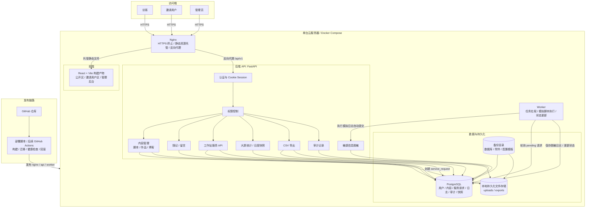

# Lumitime 系统架构图

版本：v1.0  
日期：2026-06-14  
适用阶段：技术评审 / 开发实施 / 部署上线

```mermaid
flowchart TB
    subgraph Users["访问端"]
        Visitor["访客"]
        Invited["邀请用户"]
        Admin["管理员"]
    end

    subgraph Server["单台云服务器 / Docker Compose"]
        Nginx["Nginx\nHTTPS 终止 / 静态资源托管 / 反向代理"]

        subgraph Frontend["前端"]
            React["React + Vite 构建产物\n公开区 / 邀请用户区 / 管理后台"]
        end

        subgraph Backend["后端 API: FastAPI"]
            Auth["认证与 Cookie Session"]
            RBAC["权限控制"]
            Content["内容管理\n脚本 / 作品 / 博客"]
            Message["随记 / 留言"]
            Workstation["工作站服务 API"]
            Dashboard["大屏统计 / 日度快照"]
            Export["CSV 导出"]
            Audit["审计记录"]
            Sanitizer["敏感信息脱敏"]
        end

        Worker["Worker\n任务拉取 / 模拟脚本执行 / 状态更新"]

        subgraph Data["数据与持久化"]
            DB[("PostgreSQL\n用户 / 内容 / 服务请求 / 日志 / 审计 / 快照")]
            Files[("本地持久化文件存储\nuploads / exports")]
            Backup[("备份目录\n数据库 / 附件 / 配置模板")]
        end
    end

    subgraph CI["发布链路"]
        GitHub["GitHub 仓库"]
        Deploy["部署脚本 / 后续 GitHub Actions\n构建 / 迁移 / 健康检查 / 回滚"]
    end

    Visitor -->|"HTTPS"| Nginx
    Invited -->|"HTTPS"| Nginx
    Admin -->|"HTTPS"| Nginx

    Nginx -->|"托管静态文件"| React
    Nginx -->|"反向代理 /api/v1"| Auth

    Auth --> RBAC
    RBAC --> Content
    RBAC --> Message
    RBAC --> Workstation
    RBAC --> Dashboard
    RBAC --> Export
    RBAC --> Audit

    Content --> DB
    Message --> DB
    Workstation --> DB
    Dashboard --> DB
    Export --> DB
    Audit --> DB
    Sanitizer --> DB

    Content --> Files
    Export --> Files

    Workstation -->|"创建 service_request"| DB
    Worker -->|"轮询 pending 请求"| DB
    Worker -->|"执行模拟日志自动提交"| Sanitizer
    Worker -->|"保存脱敏日志 / 更新状态"| DB

    Backup --> DB
    Backup --> Files

    GitHub --> Deploy
    Deploy -->|"发布 nginx / api / worker"| Server
```

